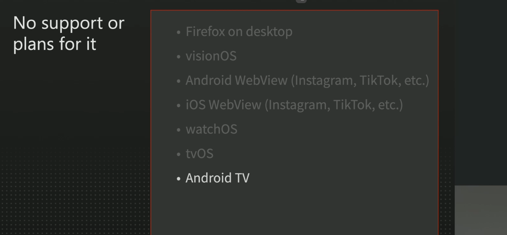
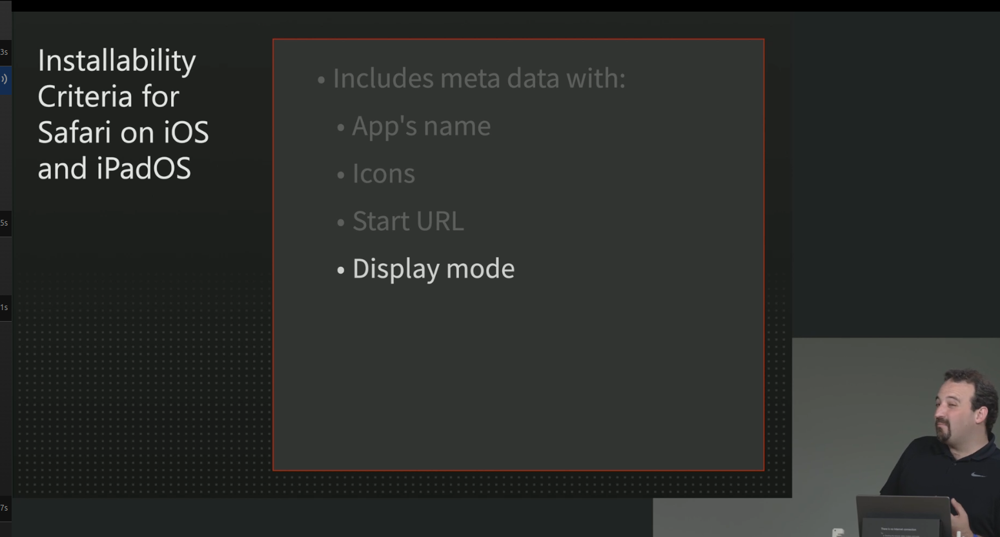
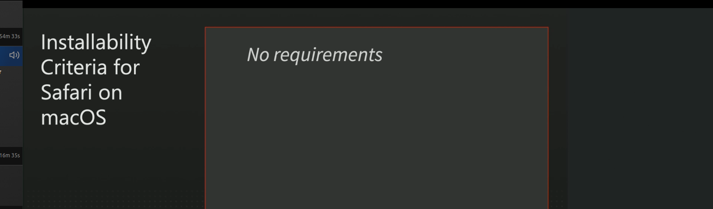
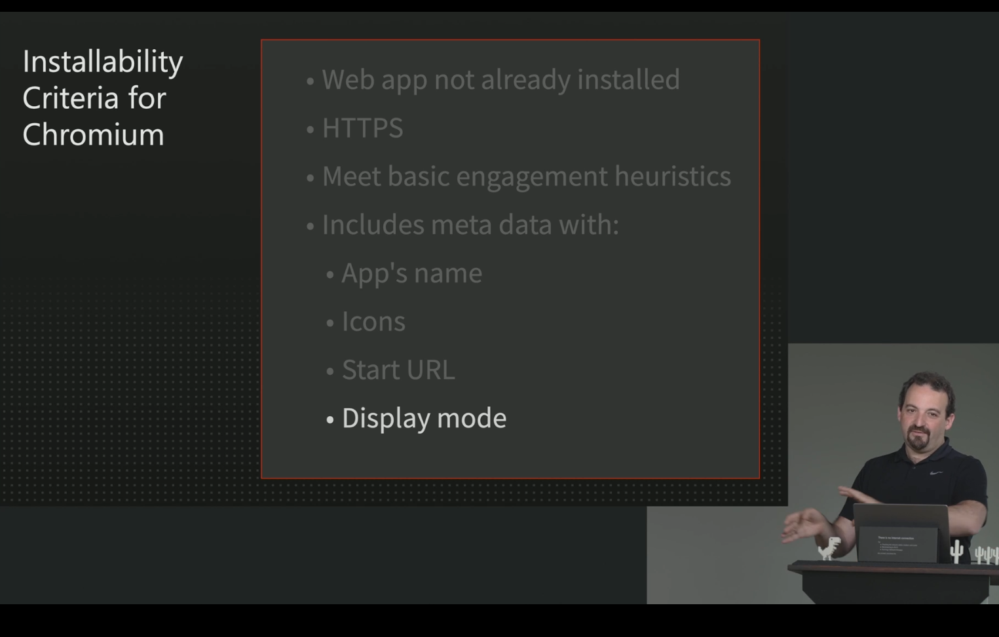
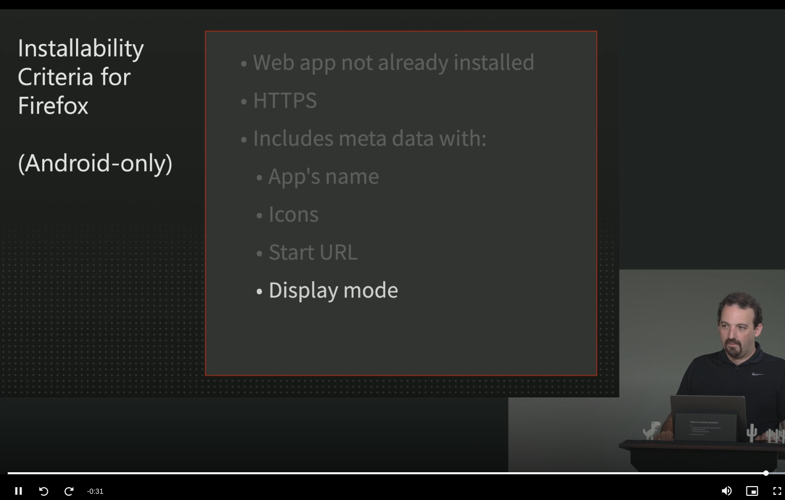
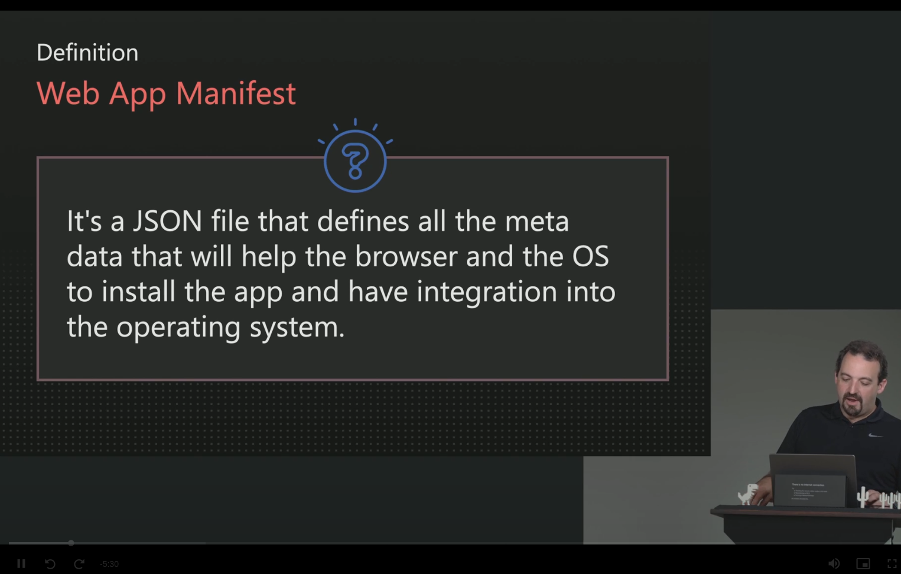

# simform-goal-pwa

## No support or plans for PWA support:

## Installability Criteria :

- If your app is following a installibity criteria for a specific platform, That platform will display different install instruction to user

## Web App Manifest :

## Display Mode:

- browser
- standalone
- fullscreen
- minimal-ui

## Service Worker: 

## Check installed service workers: chrome://serviceworker-internals

